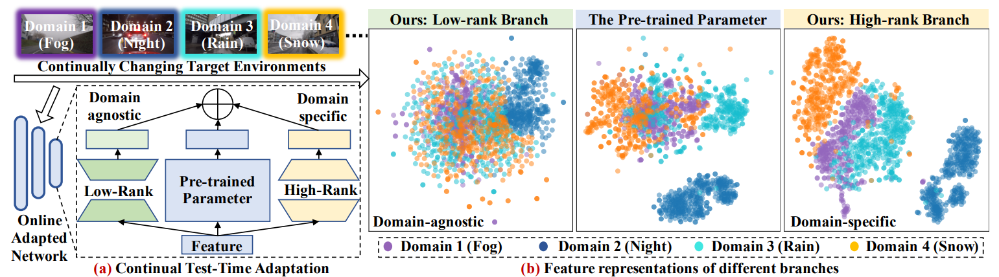

# ViDA: Homeostatic Visual Domain Adapter for Continual Test Time Adaptation
[**ViDA: Homeostatic Visual Domain Adapter for Continual Test Time Adaptation**](https://arxiv.org/abs/2306.04344)

Jiaming Liu*, Senqiao Yang*, Peidong Jia, Ming Lu, Yandong Guo, Wei Xue, Shanghang Zhang



## Overview

Since real-world machine systems are running in non-stationary and continually changing environments, Continual Test-Time Adaptation (CTTA) task is proposed to adapt the pre-trained model to continually changing target domains. Recently, existing methods mainly focus on model-based adaptation, which aims to leverage a self-training manner to extract the target domain knowledge. However, pseudo labels can be noisy and the updated model parameters are uncertain under dynamic data distributions, leading to error accumulation and catastrophic forgetting in the continual adaptation process. To tackle these challenges and maintain the model plasticity, we tactfully design a Visual Domain Adapter (ViDA) for CTTA, explicitly handling both domain-specific and domain-agnostic knowledge. Specifically, we first comprehensively explore the different domain representations of the adapters with trainable high and low-rank embedding space. Then we inject ViDAs into the pre-trained model, which leverages high-rank and low-rank prototypes to adapt the current domain distribution and maintain the continual domain-shared knowledge, respectively. To adapt to the various distribution shifts of each sample in target domains, we further propose a Homeostatic Knowledge Allotment (HKA) strategy, which adaptively merges knowledge from each ViDA with different rank prototypes. Extensive experiments conducted on four widely-used benchmarks demonstrate that our proposed method achieves state-of-the-art performance in both classification and segmentation CTTA tasks. In addition, our method can be regarded as a novel transfer paradigm and showcases promising results in zero-shot adaptation of foundation models to continual downstream tasks and distributions.

## Installation

Please create and activate the following conda envrionment. 
```bash
# It may take several minutes for conda to solve the environment
conda update conda
conda env create -f environment.yml
conda activate vida 
```

## Classification Experiments
### ImageNet-to-ImageNetC task 
We release the code of the baseline method based on CNN and vit. 
* **CNN** as the backbone
```bash
cd imagenet
bash ./bash/source_cnn.sh # Source model directly test on target domain
bash ./bash/tent_cnn.sh # Tent 
bash ./bash/cotta_cnn.sh # CoTTA
```
* **ViT** as the backbone
```bash
cd imagenet
bash ./bash/source_vit.sh # Source model directly test on target domain
bash ./bash/tent_vit.sh # Tent 
bash ./bash/cotta_vit.sh # CoTTA
```

Additional codes will be available soon.
## Citation
Please cite our work if you find it useful.
```bibtex
@article{liu2023vida,
  title={ViDA: Homeostatic Visual Domain Adapter for Continual Test Time Adaptation},
  author={Liu, Jiaming and Yang, Senqiao and Jia, Peidong and Lu, Ming and Guo, Yandong and Xue, Wei and Zhang, Shanghang},
  journal={arXiv preprint arXiv:2306.04344},
  year={2023}
}
```

## Acknowledgement 
+ CoTTA code is heavily used. [official](https://github.com/qinenergy/cotta) 
+ KATANA code is used for augmentation. [official](https://github.com/giladcohen/KATANA) 
+ Robustbench [official](https://github.com/RobustBench/robustbench) 

## Data links
+ ImageNet-C [Download](https://zenodo.org/record/2235448#.Yj2RO_co_mF)

